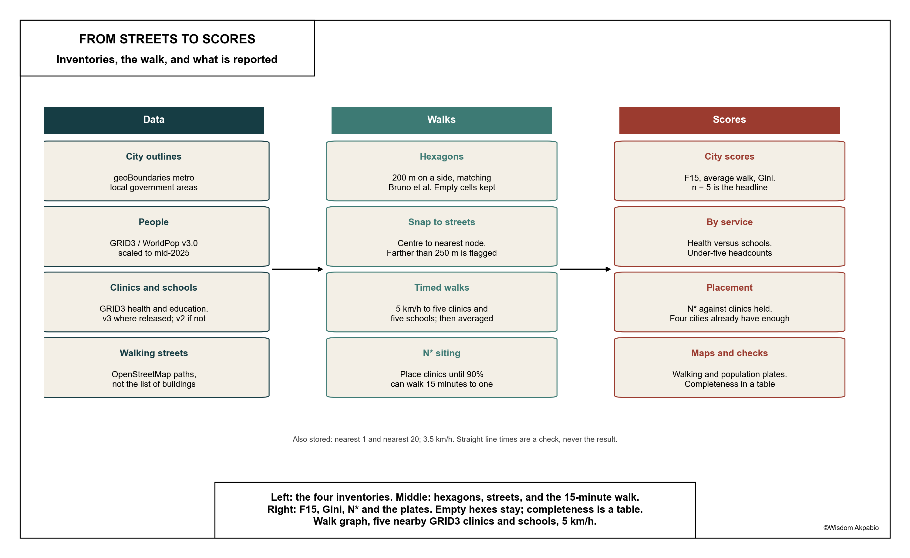
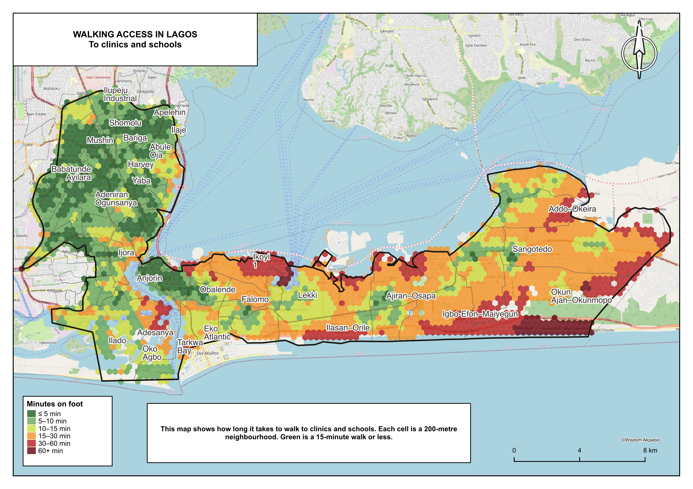
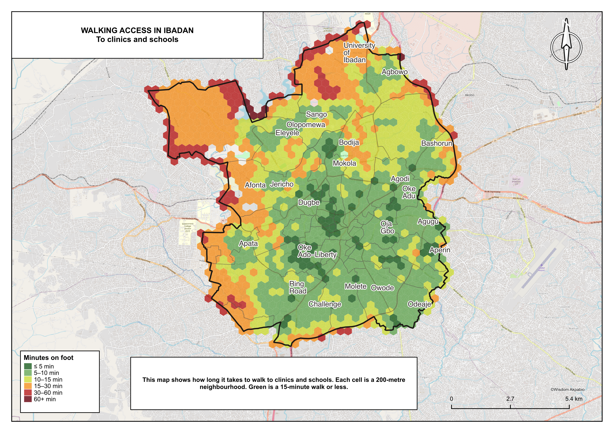
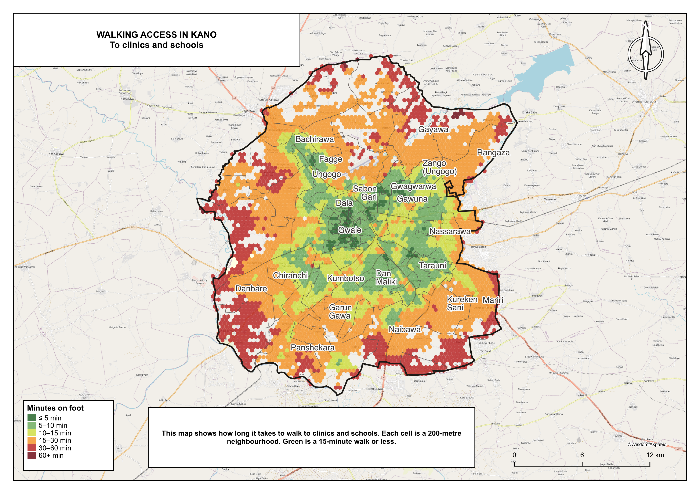
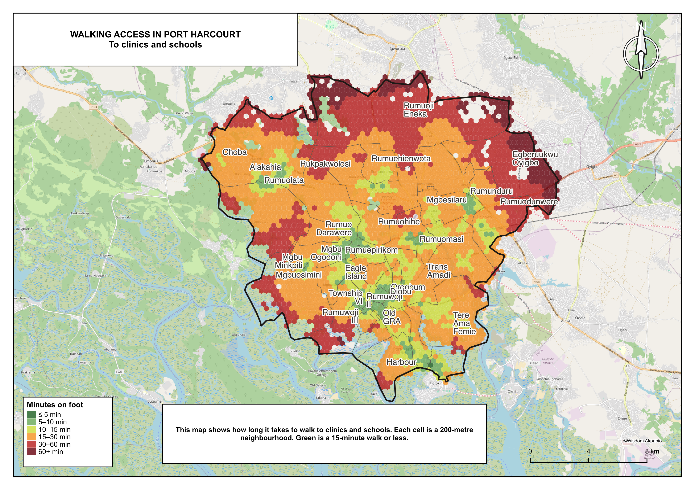
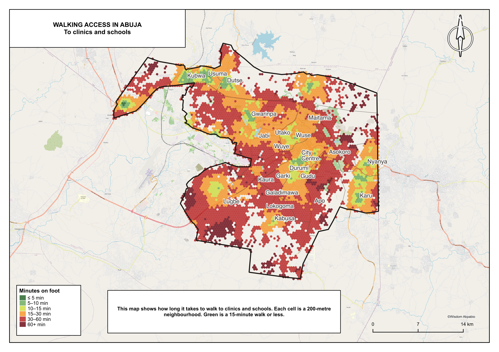

How long is the walk to a clinic, or to a school, if the trip has to be made on foot along streets that actually appear on the map?

[Bruno, Melo, Campanelli and Loreto (2024)](https://doi.org/10.1038/s44284-024-00119-4) scored a fifteen-minute limit across many cities using OpenStreetMap amenities. The numbers below use GRID3’s lists of Nigerian clinics and schools instead, and they time the walk at 5 km/h to the five nearest of each. The five cities are Lagos, Kano, Ibadan, Abuja and Port Harcourt, about 20 million people in all.

Most of Lagos and Ibadan already finish inside fifteen minutes (85% and 82%). Kano is denser than both and reaches 67%, because the later population lives in Ungogo and Kumbotso while the clinics stayed in the old city. Port Harcourt is 31%. Abuja is 21%.

::: {.table-block}

Share of people who can walk to clinics and schools in 15 minutes. Walking on mapped streets, at 5 km/h, using the five nearest clinics and the five nearest schools. Figures rounded.

| City | People | Average walk | Within 15 minutes |
|---|---|---|---|
| Lagos | 8.7 million | 10 minutes | 85% |
| Ibadan | 1.2 million | 11 minutes | 82% |
| Kano | 5.8 million | 14 minutes | 67% |
| Port Harcourt | 2.3 million | 21 minutes | 31% |
| Abuja | 2.6 million | 30 minutes | 21% |

:::

::: {.keep}
# Crowding and siting

A short walk needs people living near one another, and it needs the clinic or school to stand where those people actually live. Ibadan has both: hundreds of clinics for 1.2 million people, on a street map that is almost complete. Lagos has no shortage of buildings either; they stayed on the mainland after the Lekki corridor filled up.

If crowding were enough, Kano would sit with Lagos and Ibadan, and Port Harcourt would sit nearer both of them than to Abuja. Kano is the densest of the five and still trails Lagos, with far fewer clinics per person. The walled city and Sabon Gari remain walkable. About 45% of the city now lives later, in Ungogo and Kumbotso. Port Harcourt is crowded too, yet it keeps only 75 clinics per million people against 364 in Ibadan, and those clinics still sit in the old township while most residents now live next door in Obio/Akpor. Abuja was drawn as a capital territory, so most people cannot walk fifteen minutes even before the unfinished street map is taken into account.

Lagos, Ibadan, Kano and Port Harcourt already hold more clinics than they would need if the buildings stood in the right places. Another clinic on a well-served mainland will not shorten the walk in Ikoyi or Ungogo. Abuja holds fewer than that layout would need.
:::

::: {.table-block}

How many well-placed clinics would put 90% of people within a 15-minute walk of one clinic. “They cover” applies the same rule to clinics already on the map.

| City | Needed | Per 100,000 people | Already there | They cover |
|---|---|---|---|---|
| Ibadan | 58 | 4.7 | 445 | 92% |
| Port Harcourt | 115 | 4.9 | 175 | 66% |
| Kano | 119 | 2.1 | 465 | 89% |
| Abuja | 345 | 13.4 | 307 | 55% |
| Lagos | 327 | 3.8 | 2,303 | 90% |

:::

Ibadan and Port Harcourt need almost the same number of well-placed clinics per 100,000 people. Port Harcourt already holds 175 and reaches only 66% with them; the spare buildings sit in the township. Lagos spends 2,303 clinics to do the work 327 well-placed ones would do. Abuja is the only city where the needed count exceeds the stock.

Far on the map can mean a missing clinic or a street that has not been drawn. The table below sits next to every 15-minute score. Ibadan’s street map is almost finished. Abuja still has the farthest typical neighbourhood, 198 metres from a mapped walking street: about 45% of its tiles, holding 3% of its people.

::: {.table-block}

Distance from each neighbourhood centre to the nearest walking street. Off-map is farther than 250 metres. OSM / GRID3 is the school count in the same box: OpenStreetMap holds under a fifth of GRID3 schools in every city.

| City | Typical distance | Tiles off-map | People off-map | OSM / GRID3 schools |
|---|---|---|---|---|
| Ibadan | 47 m | 0.7% | 0.1% | 0.07 |
| Port Harcourt | 56 m | 13.3% | 0.5% | 0.17 |
| Lagos | 67 m | 24.8% | 2.8% | 0.08 |
| Kano | 71 m | 18.6% | 0.9% | 0.19 |
| Abuja | 198 m | 45.2% | 3.1% | 0.12 |

:::

# On the maps

The same neighbourhoods can be panned at [https://whizialfa.github.io/15-min-cities-nigeria/](https://whizialfa.github.io/15-min-cities-nigeria/). Lagos and Abuja on that map are the tighter cuts in the table below, not the city-wide shares at the top.

Nine of Lagos’s sixteen local government areas, about 6 million people, are left off the Lagos map below. They already live inside fifteen minutes. Alimosho alone holds 2.4 million of them. What the map actually shows is Eti-Osa: Ikoyi, Falomo, Lekki, Ajah, Sangotedo. Victoria Island sits in between. Mushin, Yaba, Surulere and Apapa are green. South of the docks, Ilado and Oko Agbo sit on creek islands that the street map treats as land. The trip is often a boat.

Ibadan’s core from Dugbe through Agodi, Agugu and Molete is close. Olopomewa, a large western ward of 78,000 people, averages twenty-two minutes. Eleyele, next door, is already inside fifteen minutes.

Kano’s 67% is the fringe. Dala, the Municipal Area, Tarauni and Nassarawa still work. Ungogo and Kumbotso hold 2.6 million people between them. Some named wards there, Gayawa among them, have almost no one inside fifteen minutes. Schools do more of the work than clinics.

The named city of Port Harcourt is the island and township around Old GRA, Orogbum, Township VI and Rumuwoji. Most of the people, and most of the long walks, sit in Obio/Akpor. Rumuoji Eneka, more than 200,000 people, is outside fifteen minutes.

Garki, Wuse, Maitama and Asokoro were drawn for a smaller Abuja. Gwarinpa and Kabusa, including Lokogoma and Apo, now hold most of the AMAC people and sit well outside fifteen minutes. Kubwa, Dutse and Usuma in Bwari sit on the plate and pull the city score up; Usuma is closer than Gwarinpa. Karu is the closest of the AMAC wards. Gui, off the tighter map, is 132,000 people at about an hour. The 21% figure mixes real distance with an unfinished street map.

::: {.table-block}

The Lagos and Abuja maps are tighter cuts. City-wide scores stay in the first table. Walking on mapped streets, five nearby places, 5 km/h. Figures rounded.

| Map | People | Within 15 minutes |
|---|---|---|
| Lagos, seven local government areas | 2.3 million | 71% |
| Lagos, nine areas off the map | 6.3 million | 91% |
| Abuja, ten wards | 2.0 million | 25% |
| Abuja, four AMAC wards off the map | 490,000 | 11% |

:::

# Children

In four of the five cities, clinics are farther than schools. Averaging the two into one number makes that look like moderate access.

::: {.table-block}

Share of people within a 15-minute walk of a clinic, and of a school, timed separately. Five nearby places, 5 km/h.

| City | Clinics | Schools |
|---|---|---|
| Lagos | 75% | 91% |
| Ibadan | 82% | 80% |
| Kano | 56% | 74% |
| Port Harcourt | 25% | 47% |
| Abuja | 18% | 32% |

:::

The gap is 22 points in Port Harcourt. Ibadan is the only city where schools trail clinics, and the only one that holds roughly as many of each. Apply each city’s clinic score to its under-fives and about **1.2 million** children under five live more than fifteen minutes from a clinic: 426,000 in Kano, 313,000 in Abuja, 233,000 in Lagos, 228,000 in Port Harcourt, 31,000 in Ibadan. Those figures are the city score laid onto children. Kano is also young, which is why it carries the largest share.

# How the walks were timed

Each city is cut into neighbourhood tiles about 200 metres across. From the centre of each tile, walking time is measured along mapped streets to the five nearest clinics and the five nearest schools, then averaged. People in that tile count as served if the average is 15 minutes or less.

<figure>
<figcaption>How the scores are made. Inventories on the left, the walk in the middle, what is reported on the right.</figcaption>

</figure>

Clinic and school locations come from GRID3, the lists used in public-health mapping. Population comes from GRID3 and WorldPop, scaled to mid-2025. Streets come from OpenStreetMap. Those streets are not used as the list of clinics and schools; in these cities OSM holds only a fraction of the schools.

Count only the nearest clinic and every dense city looks almost finished. Count twenty, as [Bruno et al. (2024)](https://doi.org/10.1038/s44284-024-00119-4) did, and Port Harcourt falls to 1% and Abuja to 0.1%. Five nearby places sits between those two rules. The middle column is the headline used everywhere else in this account.

::: {.table-block}

Share of people within 15 minutes if one, five or twenty nearby clinics and schools count. Walking on mapped streets, 5 km/h.

| City | Nearest 1 | Five (headline) | Twenty |
|---|---|---|---|
| Lagos | 95% | 85% | 49% |
| Ibadan | 94% | 82% | 44% |
| Kano | 92% | 67% | 21% |
| Port Harcourt | 74% | 31% | 1% |
| Abuja | 58% | 21% | 0.1% |

:::

Five kilometres an hour is a brisk walk. Heat, broken paths and floodwater slow people down. At 3.5 km/h the shares fall, Kano from 67% to 43%. The speed belongs with the number.

Empty land stays on the map. Dropping it would make the city look closer by cutting the fringe out of the question. The headline share still counts people, so empty tiles do not drag it down. Gwarinpa and Kabusa drag it down because people live there.

::: {.keep}
# What was not timed

Only walking is timed. Danfo, shared taxis and private cars are omitted. Whether a clinic is staffed, open or affordable is also outside the data.
:::

The maps show where a fifteen-minute walk already exists, and where the city has grown past its clinics. In Lagos, Ibadan, Kano and Port Harcourt the remaining walk depends on where the buildings sit. In Abuja it also depends on streets the map has not finished drawing.

Methods and references are in the [full paper](fifteen_minute_access_nigeria.pdf). The live map is at [https://whizialfa.github.io/15-min-cities-nigeria/](https://whizialfa.github.io/15-min-cities-nigeria/).

© Wisdom Akpabio, 2026. Clinic, school and population data from GRID3 and WorldPop. Streets from OpenStreetMap.

<figure class="plate-page">
<figcaption>Lagos. Green is a 15-minute walk or less. The inner mainland is green; Eti-Osa is farther.</figcaption>

</figure>

<figure class="plate-page">
<figcaption>Ibadan. Close through the core. Olopomewa, west of Eleyele, is the main gap.</figcaption>

</figure>

<figure class="plate-page">
<figcaption>Kano. Dala, Fagge and Tarauni sit inside 15 minutes. Ungogo and Kumbotso sit farther out.</figcaption>

</figure>

<figure class="plate-page">
<figcaption>Port Harcourt. The old township is green. Obio/Akpor, where most people now live, is farther.</figcaption>

</figure>

<figure class="plate-page">
<figcaption>Abuja. Karu is the closest of the lived-in wards. Gwarinpa, Kabusa, Apo and Lokogoma sit farther out.</figcaption>

</figure>
