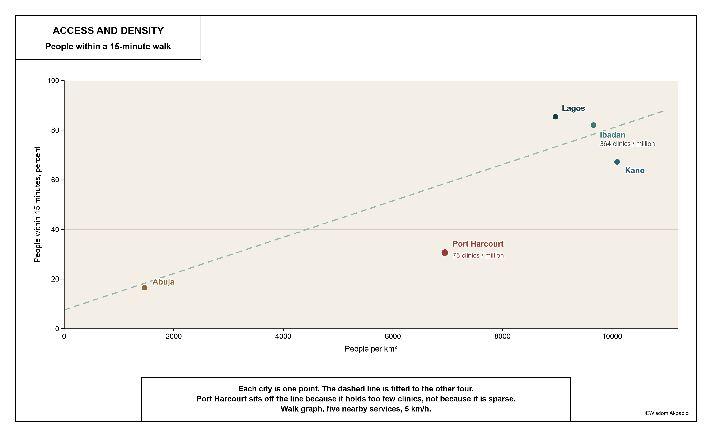
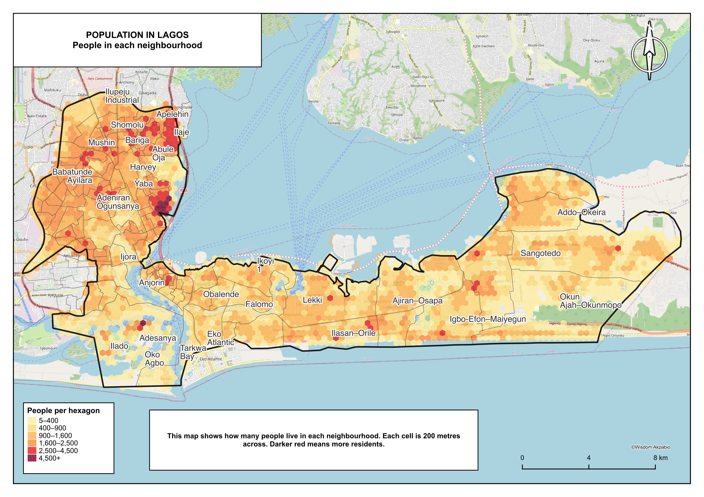
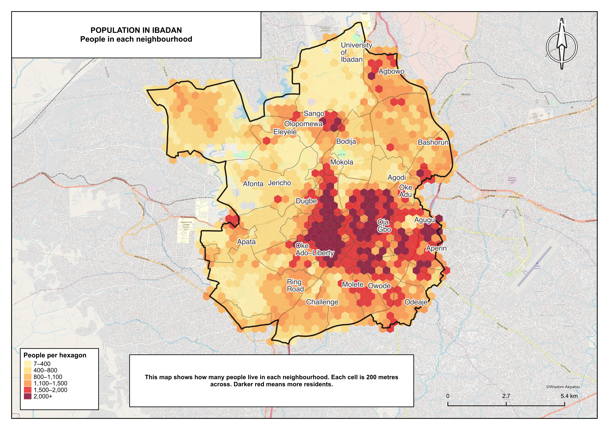
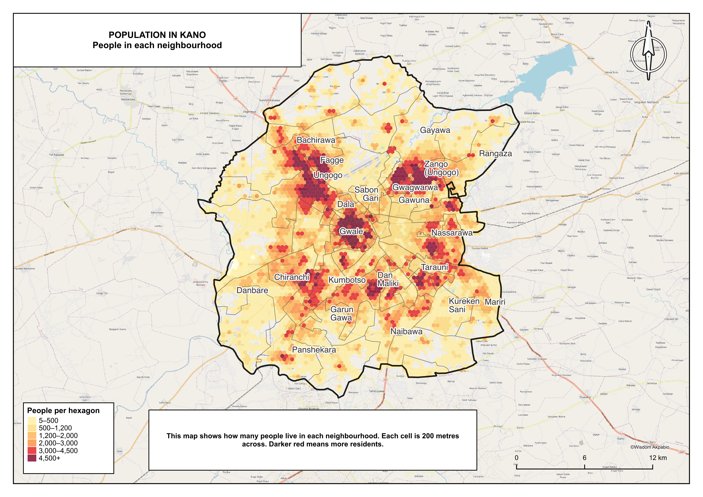
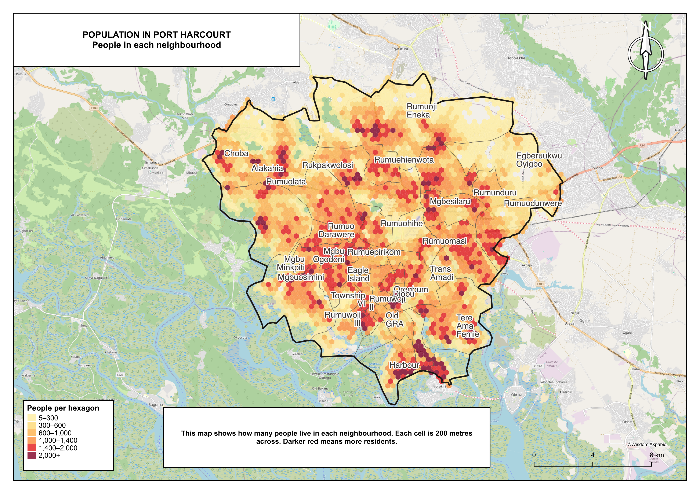
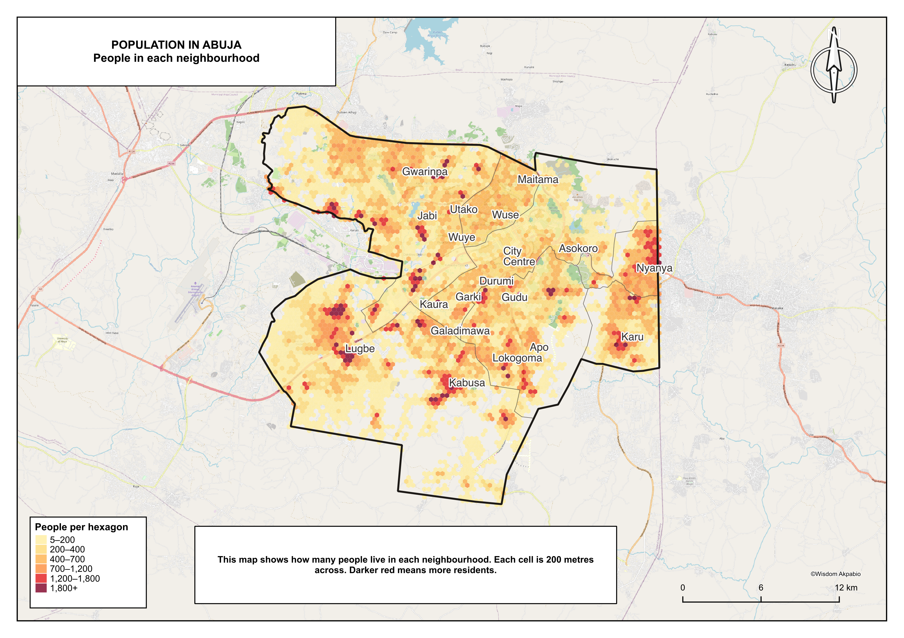
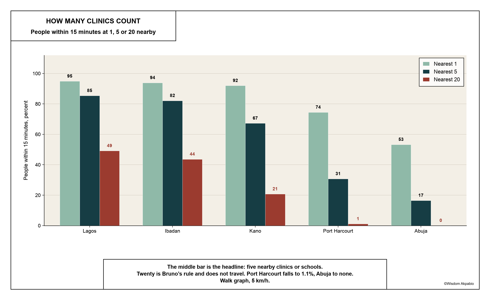
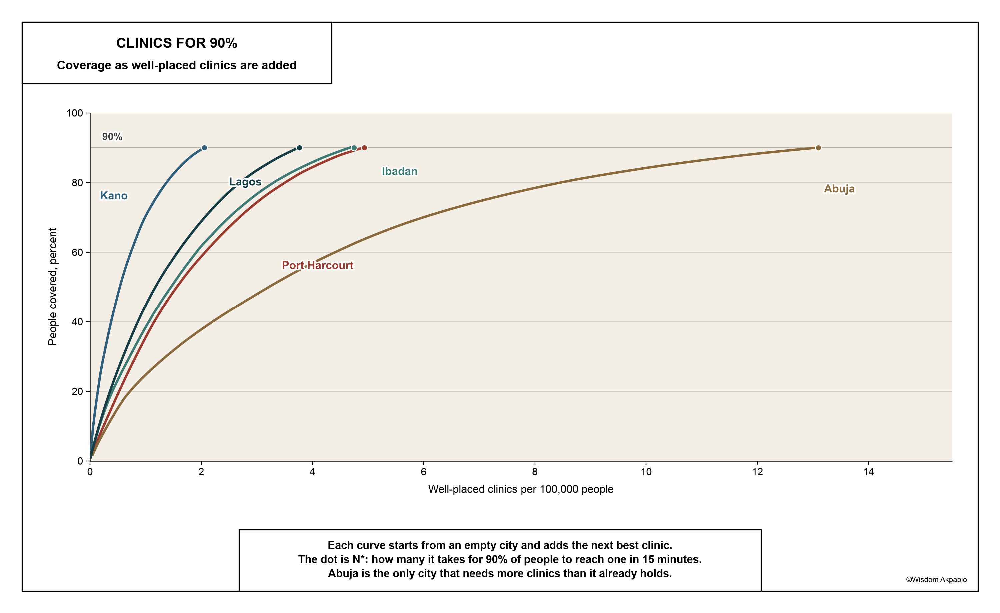

## Glossary

<dl>

<dt>Walk time (PTk)</dt>
<dd>From one neighbourhood: time the walk to five clinics and average those, do the same for five schools, then average the two. Minutes. Equation (1) in section 4.2.</dd>

<dt>City walk time (PTcity)</dt>
<dd>That neighbourhood walk, averaged across the city, counting neighbourhoods with more people more heavily. Ten minutes means a typical person is about a ten-minute walk from that mix of clinics and schools. Equation (2).</dd>

<dt>F15</dt>
<dd>Share of people whose neighbourhood walk is 15 minutes or less. If a city is 85%, about 85 in 100 live in a neighbourhood that meets that bar. The main 15-minute-city score. Equation (3).</dd>

<dt>Gini</dt>
<dd>How uneven those walks are, from 0 (everyone waits the same) to 1. F15 counts how many people are inside 15 minutes; Gini says whether the rest of the line is flat or has a long far tail. A high Gini can sit next to a high F15. Equation (4).</dd>

<dt>n (choice of nearby places)</dt>
<dd>How many clinics or schools count toward the average. The headline is five, because one nearby place is too easy and twenty is the rule used by <a href="https://doi.org/10.1038/s44284-024-00119-4">Bruno et al. (2024)</a>. Table 2 stores all three.</dd>

<dt>N*</dt>
<dd>Ignore the clinics that already exist. How many new clinics, placed one by one on the walking network to cover the most remaining people each time, would put 90% of residents within a 15-minute walk of <em>one</em> clinic. A siting test. It is not F15: F15 averages five clinics and five schools. Equations (5)–(6).</dd>

<dt>Hexagon</dt>
<dd>The neighbourhood unit: a hexagon 200 m on a side, the same cell <a href="https://doi.org/10.1038/s44284-024-00119-4">Bruno et al.</a> used.</dd>

<dt>Off-network</dt>
<dd>A hexagon whose centre is more than 250 m from the nearest mapped walking street. Far on the map can mean a missing street as well as a missing clinic.</dd>

<dt>GRID3</dt>
<dd>Geo-Referenced Infrastructure and Demographic Data for Development inventories of Nigerian health facilities, schools and population.</dd>

<dt>OpenStreetMap (OSM)</dt>
<dd>The public street map, used here for walking paths, not as the list of clinics and schools.</dd>

</dl>

Section 4 writes the same quantities as formulas.

# 1. Introduction

Moreno et al. (2021) and Allam et al. (2022) put a fifteen-minute walk at the centre of a planning vocabulary that has since travelled well beyond Paris. The measurement problem underneath that vocabulary is older: how near people live to the places they need, and how that nearness is timed (Hansen, 1959; Geurs and van Wee, 2004). Change the destination list or the impedance and neighbourhood rankings move (Apparicio et al., 2008; Logan et al., 2022; Guzman, Oviedo and Cantillo-Garcia, 2024).

[Bruno, Melo, Campanelli and Loreto (2024)](https://doi.org/10.1038/s44284-024-00119-4) turned the vocabulary into scores that can be compared across cities. From each small neighbourhood they time the walk to nearby services, average those times, and report the share of people who finish in 15 minutes or less (F15), the city-wide average walk, and how uneven the walks are (Gini). A fourth number, N\*, asks how many well-placed services would put 90% of people inside 15 minutes. Their atlas includes Lagos. Amenities there come from OpenStreetMap tags; cities are clipped to OECD or Global Human Settlement outlines; twenty nearby places are required. Those choices fit a worldwide panel. They also assume services that are many, interchangeable, and already tagged.

GRID3 is the inventory Nigerian health and education already keep. OSM amenity tags are not, and OSM holds only a fraction of the schools even where the street map is good (Herfort et al., 2023; Barrington-Leigh and Millard-Ball, 2017). The urban population has grown faster than the clinics and schools inside it (Aliyu and Amadu, 2017; UN-Habitat, 2022). Lagos was never fully under one plan (Olajide and Lawanson, 2022). Abuja was planned, then filled in ways the master plan did not expect (Abubakar, 2014). Walking still has to be possible on days when a fare, a bus, or fuel is not. Weiss et al. (2020) map travel time to healthcare at about a kilometre and with a motor in the assumption. A ward chairman cannot tell from those maps whether the clinic is twelve minutes or fifty. This paper times the walk to GRID3 clinics and schools in five cities, on the streets that are mapped.

# 2. Statement of the problem

The published rule of twenty nearby OpenStreetMap amenities, copied here, sends Port Harcourt to about one percent and Abuja to none. That result is true of the rule. It is a poor description of either city. GRID3 already locates the clinics and schools. Ibadan’s street map is nearly complete; Abuja’s is not. A score that ignores both inventories is a score of someone else’s map.

The questions that follow are narrower. With GRID3 points and walking on mapped streets, how close are Lagos, Kano, Ibadan, Abuja and Port Harcourt to a fifteen-minute walk? How much of that closeness is an artefact of how many nearby places count, or of walking speed in heat? And where the score is low, is the city short of clinics, did the clinics stay behind when the population moved, or is an unmapped street being counted as empty land?

# 3. Study area

The five cities are Lagos, Kano, Ibadan, Abuja and Port Harcourt. Together they hold about 20 million people on the GRID3 / WorldPop Nigeria v3.0 grid, scaled to UN estimates for July 2025. Each city is the group of local government areas that make up the built-up core, dissolved from geoBoundaries (Runfola et al., 2020). Global Human Settlement urban-centre polygons (Florczyk et al., 2019) are not used; they are not on disk here. Areas are measured on the study-boundary file in the local UTM zone. A port, a walled city, a colonial railway town, an oil township and a purpose-built capital do not become walkable in the same way, and the boundary chosen for each one already decides where the city is said to stop.

### Lagos

Alimosho alone holds 2.36 million people. Dropping it from the metric would describe the peninsula, not Lagos. The city used here is the 16 continuous urban local government areas of the mainland and the islands, without Epe, Ibeju-Lekki, Badagry or Ikorodu: 969 km², 8.69 million people, 8,965 per km². It has never been governed as a single planned city (Olajide and Lawanson, 2022). The old island, the colonial and post-independence mainland, and the Lekki corridor grew under different rules. The walking plates draw a tighter city of seven of those areas (Eti-Osa, Lagos Island, Apapa, Lagos Mainland, Surulere, Mushin and Shomolu) so the Lekki corridor and the inner mainland sit in one frame. Headline scores stay on the 16-area metro.

### Ibadan

The six outer local government areas around Ibadan add 2,746 km² of mostly thin settlement at about 1,455 people per km². Including them would drown the core in bush. The city used here is the five core areas only (Ibadan North, North East, North West, South East and South West): 126 km², 1.22 million people, 9,659 per km². It is the most compact city in the set, and the one whose street map is closest to complete. The indigenous core, the university north of Sango, and the western fringe toward Eleyele sit inside one small outline. That is why a single poorly served ward can move the city score.

### Kano

Ungogo to the north and Kumbotso to the south now hold more people than the walled city and Sabon Gari. A 15-minute score that only looked at Fagge and the Municipal Area would describe a city that no longer exists. The outline is eight metro local government areas (Dala, Fagge, Gwale, Kano Municipal, Kumbotso, Nassarawa, Tarauni, Ungogo): 573 km², 5.78 million people, 10,092 per km², the densest of the five. The plates keep that eight-area metro and label those districts rather than every Unguwar and Tudun.

### Abuja

The Municipal Area Council is 1,476 km² at 1,470 people per km²: a capital territory rather than a compact city (Abubakar, 2014; Abubakar and Doan, 2017). The original districts (Garki, Wuse, Maitama, Asokoro) were drawn for a much smaller population. Gwarinpa and Kabusa, including Lokogoma, now hold most of the people. Gui, Orozo, Gwagwa and Jiwa sit on the same AMAC polygon and pull the choropleth toward empty land. Headline scores stay on all of AMAC. The plates draw seven wards only (Gwarinpa, Wuse, Nyanya, Karu, City Centre, Garki and Kabusa) so the city that is actually lived in can be seen.

### Port Harcourt

Obio/Akpor holds most of the people and most of the gap. Treating the island and township as the city would make a 15-minute capital of an oil city that has already grown past its old edge. Port Harcourt as scored here is two local government areas, Port Harcourt and Obio/Akpor: 336 km², 2.33 million people, 6,946 per km². Rumuoji Eneka, Rumunduru, Alakahia, Mgbu Minkpiti and Woji sit in that second area. Both stay in the metric and on the plate.

# 4. Data and methods

City outlines are metro local-government areas from geoBoundaries, dissolved per city. Each outline is filled with hexagons 200 m on a side, matching [Bruno et al. (2024)](https://doi.org/10.1038/s44284-024-00119-4). Empty hexagons stay on the map. Deleting them would raise F15 by cutting the uninhabited fringe out of the question. F15 is weighted by people, so empty cells do not punish the score, but they still belong on the plate. Population in each hexagon is summed from GRID3 / WorldPop Nigeria v3.0 (Tatem, 2017; Bondarenko et al., 2020). Clinic points come from GRID3 health facilities v3 in Kano, Ibadan and Abuja, and from health v2 in Lagos and Port Harcourt, where v3 has not been released. School points come from the GRID3 education layer. OpenStreetMap amenity tags are not the inventory: in the same bounding box, OSM holds between 7% and 19% of GRID3 schools.

<figure>
<figcaption>Figure 1. Inventories, the walking network, and the scores that follow. Walking on mapped streets at 5 km/h to the five nearest clinics and the five nearest schools. Completeness is a table, not a hatch on the plates.</figcaption>

</figure>

## 4.1 Walking on mapped streets

Pedestrian streets are downloaded with OSMnx (Boeing, 2017) and cached. Walking speed is 5 km/h, the same convention Bruno et al. use. Times at 3.5 and 4.5 km/h are stored as well, because heat, broken paths and flooding make 5 km/h optimistic. Straight-line times are computed as a check and are never used as the result.

Let hexagon $k$ have population $w_k \ge 0$ and centre $c_k$. The centre is snapped to the nearest node of the walk graph. Edge time is length $\ell_{uv}$ at 5 km/h:

::: {.eq-block}
$$
t_{uv} = \frac{\ell_{uv}}{5000/60} \quad \text{minutes.}
$$
:::

Network time $d(c_k, p)$ is the shortest-path time from that snapped node to facility $p$. A snap longer than 250 m flags the hexagon as off-network: far on the map can mean a missing street as well as a missing clinic.

## 4.2 Dual access, walk time and F15

The 15-minute test here is not whether one clinic sits next door. From each neighbourhood we time the walk to five clinics, average those, do the same for five schools, then average the two. One mapped point can make a neighbourhood look finished even if the next four are far. Averaging five is a check that the neighbourhood is not relying on a single building. One nearby place is stored as a comparison. Twenty is Bruno et al.’s rule and is stored as a stress test (Table 2). Five is the headline.

For clinics $H$, let $n_k^{\mathrm{h}} = \min(5,\, \#\{\text{clinics reachable from } k\})$. Write $p^{\mathrm{h}}_{(j)}$ for the $j$-th nearest clinic. Then

::: {.eq-block}
$$
T^{\mathrm{h}}_{k} = \frac{1}{n_k^{\mathrm{h}}} \sum_{j=1}^{n_k^{\mathrm{h}}} d(c_k,\, p^{\mathrm{h}}_{(j)}).
$$
:::

School time $T^{\mathrm{s}}_{k}$ is the same construction on the school list $S$. If fewer than five of a service are reachable, the mean is over those found. If none are reachable, that service time is undefined.

The neighbourhood walk time is the mean of the two service times when both exist, and the one that exists if only one does:

::: {.eq-block .numbered}
$$
\mathrm{PT}_{k} = \frac{T^{\mathrm{h}}_{k} + T^{\mathrm{s}}_{k}}{2}.
$$
:::

The city’s average walk counts neighbourhoods with more people more heavily. Ten minutes means a typical person is about a ten-minute walk from that mix of clinics and schools. It is not the nearest building, and it is not a car.

::: {.eq-block .numbered}
$$
\mathrm{PT}_{\mathrm{city}} = \frac{\sum_{k:\,\mathrm{PT}_{k} < \infty} w_k\,\mathrm{PT}_{k}}{\sum_{k:\,\mathrm{PT}_{k} < \infty} w_k}.
$$
:::

F15 is the share of people whose neighbourhood walk is 15 minutes or less. If Lagos is 85%, about 85 in 100 live in a neighbourhood that meets that bar. The other 15 do not.

::: {.eq-block .numbered}
$$
\mathrm{F15} = \frac{\sum_{k:\,\mathrm{PT}_{k} \le 15} w_k}{\sum_{k:\,\mathrm{PT}_{k} < \infty} w_k}.
$$
:::

Health-only and school-only F15 replace $\mathrm{PT}_{k}$ with $T^{\mathrm{h}}_{k}$ or $T^{\mathrm{s}}_{k}$. A city can look close on schools and far on clinics. Averaging the two into $\mathrm{PT}_{k}$ hides that split, which is why Table 1 reports both.

People in hexagons with no finite walk time are omitted from the denominators of $\mathrm{PT}_{\mathrm{city}}$, F15 and Gini. Empty hexagons have $w_k = 0$ and do not move those scores; they stay on the map.

Age–sex grids from WorldPop v3.0 apply a constant share at state level, so they cannot show which neighbourhoods have more young children. The under-five headcount is the city health F15 applied to the city’s under-fives. Same rate, a count that can be pictured: about 228,000 under-fives in Port Harcourt live beyond a 15-minute walk of a clinic.

::: {.eq-block}
$$
U = W_{<5}\,(1 - \mathrm{F15}^{\mathrm{health}}).
$$
:::

No within-city age map is claimed.

## 4.3 Gini of walk time

F15 says how many people are inside 15 minutes. Gini says whether those walks are similar or wildly different. Line everyone up from shortest walk to longest. If the line is almost flat, Gini is low: most people wait about the same. If many people are close and a long tail is far, Gini is higher even when F15 looks good. Lagos is the example in Table 1: a working mainland averaged with a long peninsula. Gini does not say where the tail sits. The maps and the ward numbers do.

Let $x_k = \mathrm{PT}_{k}$ for hexagons with $w_k > 0$ and finite walk time, sorted so $x_1 \le \cdots \le x_m$. The score is the population-weighted discrete Gini (the Lorenz form implemented in the code is algebraically the same):

::: {.eq-block .numbered}
$$
G = \frac{\sum_{i}\sum_{j} w_i w_j |x_i - x_j|}{2\,\mu\, W^{2}},
\quad
\mu = \frac{\sum_k w_k x_k}{W},\quad
W = \sum_k w_k.
$$
:::

Zero would mean everyone has the same walk.

## 4.4 N*

N* answers a planning question, not a score of what is mapped today. Ignore the existing clinics. If new clinics could be placed on the street network, how many would be needed so that 90% of people are within a 15-minute walk of *one* of them? That count is N*. Ibadan needs 58. Lagos needs 327 because it is large. Abuja’s number is high relative to how many clinics it already has, because the people are spread out.

Two traps follow. N* uses one clinic inside 15 minutes; F15 uses the five-and-five average in (1)–(3). The two percentages are not the same rule. And N* is how many well-placed sites it would take, not how many clinics already stand. Compare it with the mapped stock, and with the share of people who can already walk 15 minutes to one of those clinics (“they cover” in Table 3). If a city already holds more clinics than N* and still leaves many people outside 15 minutes, the stock is in the wrong places. If it holds fewer than N* and still misses 90%, it is short as well as badly placed.

Candidate sites are hexagon centres snapped onto the walk graph. Site $s$ covers hexagon $k$ if $d(c_s, c_k) \le 15$. Let $A_{sk}=1$ in that case. Finding the smallest set of sites that covers 90% of people is NP-hard (maximum coverage). The implementation uses the standard greedy algorithm (Nemhauser, Wolsey and Fisher, 1978): start from $C_0 = \emptyset$, and at step $t$ add the site that covers the most still-uncovered population,

::: {.eq-block .numbered}
$$
s_t = \arg\max_s \sum_k w_k\, A_{sk}\, \mathbf{1}_{k \notin C_{t-1}},
\quad
C_t = C_{t-1} \cup \{k: A_{s_t k}=1\}.
$$
:::

Stop at the smallest $t$ with

::: {.eq-block .numbered}
$$
\frac{\sum_{k \in C_t} w_k}{\sum_k w_k} \ge 0.90.
$$
:::

That $t$ is $\mathrm{N}^*$. Greedy is within $1-1/e$ of the true optimum, so $\mathrm{N}^*$ is an upper bound on the smallest possible set. The same 15-minute, one-clinic rule applied to existing GRID3 clinics is

::: {.eq-block}
$$
\mathrm{Cov}_{\mathrm{obs}} = \frac{\sum_k w_k\, \mathbf{1}\{\min_{p \in H} d(c_k,p) \le 15\}}{\sum_k w_k}.
$$
:::

Bruno et al. move existing clinics; here the count starts from none. $\mathrm{N}^*$ ignores land, tenure, flooding and how many patients a clinic can take. $\mathrm{N}^*$ per 100,000 people is $\mathrm{N}^*$ divided by population in hundred thousands.

## 4.5 Completeness of the street map, and the plates

Median snap distance, the share of hexagons and of people off-network, and the OSM-to-GRID3 school ratio are reported with every F15 (Table 4). Abuja is the warning: the typical hexagon centre sits 263 m from a mapped walking street.

Ward outlines on the plates are GRID3 vaccination wards. Names printed on top of them are OpenStreetMap districts (`place=suburb`, `quarter` or `neighbourhood`), plus a few named residential areas OSM never promoted to a suburb (Lokogoma). GRID3 settlement points fill the rare pinned name that OSM lacks (Apo). Helvetica 14 pt, overlapping names omitted. Lagos labels are this class (Ikoyi, Victoria Island, Sangotedo). Lagos’s plate is seven local government areas (Eti-Osa, Lagos Island, Apapa, Lagos Mainland, Surulere, Mushin and Shomolu), not the 16-area metro. Abuja’s plate is seven wards only (Gwarinpa, Wuse, Nyanya, Karu, City Centre, Garki and Kabusa), not the rest of AMAC. Kabusa is what puts Lokogoma inside the drawn city.

# 5. Results

## 5.1 Who can walk 15 minutes

Lagos and Ibadan, both above 8,900 people per km², put **85.4%** and **82.1%** of residents inside a 15-minute walk. Kano is denser still (10,092 per km²) and reaches only **67.2%**. Port Harcourt, at 6,946 per km², reaches **30.7%**. Abuja, at 1,470 per km², reaches **16.5%**. Average city walk time runs from **10.3 minutes** in Lagos to **32.2 minutes** in Abuja.

The dashed line in Figure 2 is fitted to the four cities other than Port Harcourt. Compact settlement goes some way toward explaining who can walk 15 minutes. Ibadan holds 364 clinics per million people; Port Harcourt holds 75. Kano holds 80, thin enough, even in the densest of the five, to sit well below the line compactness would have predicted.

::: {.table-block}

Table 1. Walking access, five nearby places, 5 km/h. Area is the metro local-government outline.

| City | Area | Population | Density | Average walk | F15 | Gini | F15, health | F15, schools |
|---|---|---|---|---|---|---|---|---|
| Lagos | 969 km² | 8.69M | 8,965 /km² | 10.3 min | 85.4% | 0.346 | 75.2% | 91.2% |
| Ibadan | 126 km² | 1.22M | 9,659 /km² | 10.9 min | 82.1% | 0.310 | 81.9% | 79.5% |
| Kano | 573 km² | 5.78M | 10,092 /km² | 13.5 min | 67.2% | 0.291 | 55.9% | 74.4% |
| Port Harcourt | 336 km² | 2.33M | 6,946 /km² | 21.2 min | 30.7% | 0.272 | 24.7% | 47.1% |
| Abuja | 1,476 km² | 2.17M | 1,470 /km² | 32.2 min | 16.5% | 0.312 | 13.3% | 25.9% |

:::

<figure>
<figcaption>Figure 2. Share of people within a 15-minute walk against people per km². The dashed line is fitted to the four cities other than Port Harcourt. Walk graph, five nearby places, 5 km/h.</figcaption>

</figure>

Health is the weaker of the two services in four cities. The gap is **22 points** in Port Harcourt (24.7% against 47.1%). Averaging clinics with schools into one walk time hides that. Ibadan is the only city where schools trail clinics, and the only one that holds roughly as many of each (445 clinics, 453 schools). Applying the city-wide health score to each city’s under-five population gives about **1.2 million** children under five more than 15 minutes from a clinic: 426,000 in Kano, 277,000 in Abuja, 233,000 in Lagos, 228,000 in Port Harcourt, 31,000 in Ibadan. Those headcounts are the city health score laid onto under-fives.

Gini is highest in Lagos (0.346) and lowest in Port Harcourt (0.272). Bruno et al. (2024) found that cities with worse average access were also more unequal. The pattern here runs the other way. Lagos is close for most people and very far for a few: the peninsula hanging off a working city. Port Harcourt is far for almost everyone, so the low Gini is shared distance rather than shared access.

Figures 3 and 4 put Table 1 on a map. Green on the walking plates is 15 minutes or less. Lagos and Ibadan are green through most neighbourhoods that have people in them; Port Harcourt and Abuja stay yellow and red through most of the lived-in wards. Population plates use a yellow-to-red scale fitted to each city. Walking plates use one six-class minute scale in every city, with 15 minutes and 60 minutes as class edges, so the first three classes add up to F15. Sections 5.1.1–5.1.5 read each plate against the ward numbers. City-wide F15 remains the metro score in Table 1. The Lagos and Abuja plates are tighter cuts of those metros, so they can look harsher than the city-wide figure (Table 1b).

::: {.table-block}

Table 1b. Walking access on the Lagos and Abuja print plates. Headline F15 in Table 1 is the metro. Walk graph, five nearby places, 5 km/h.

| City | Outline | People | Average walk | F15 | Gini |
|---|---|---|---|---|---|
| Lagos | Seven local government areas | 2.33M | 12.6 min | 70.6% | 0.420 |
| Lagos | Nine areas off the plate | 6.26M | 9.1 min | 91.3% | 0.280 |
| Abuja | Seven wards | 1.60M | 28.4 min | 18.8% | 0.275 |
| Abuja | Four AMAC wards off the plate | 490,000 | 38.7 min | 11.7% | 0.322 |

:::

<figure class="plate-page">

<figcaption>Figure 3a. Walking access to clinics and schools in Lagos. The outline is seven local governments: Eti-Osa, Lagos Island, Apapa, Lagos Mainland, Surulere, Mushin and Shomolu. The inner mainland is green; Eti-Osa (Ikoyi, Falomo, Lekki, Ajah, Sangotedo) is farther.</figcaption>
</figure>

<figure class="plate-page">

<figcaption>Figure 3b. Walking access to clinics and schools in Ibadan. The core from Dugbe through Agodi, Agugu and Molete is green. Olopomewa, west of Eleyele, is the main gap.</figcaption>
</figure>

<figure class="plate-page">

<figcaption>Figure 3c. Walking access to clinics and schools in Kano. Dala, Fagge, Sabon Gari and Tarauni sit inside 15 minutes. Ungogo in the north and Kumbotso in the south sit well outside.</figcaption>
</figure>

<figure class="plate-page">

<figcaption>Figure 3d. Walking access to clinics and schools in Port Harcourt. Old GRA, Orogbum, Township VI, Rumuwoji II and Rumuwoji III are the green township. Obio/Akpor (Rumuoji Eneka, Rumunduru, Mgbu Minkpiti, Alakahia) is farther.</figcaption>
</figure>

<figure class="plate-page">

<figcaption>Figure 3e. Walking access to clinics and schools in Abuja. The outline is seven wards: Gwarinpa, Wuse, Nyanya, Karu, City Centre, Garki and Kabusa. Karu is the closest of those; Gwarinpa, Garki, Apo and Lokogoma sit well outside 15 minutes.</figcaption>
</figure>

<figure class="plate-page">

<figcaption>Figure 4a. Population in Lagos. People concentrate on the inner mainland (Mushin, Surulere, Yaba) and thin out along Eti-Osa toward Sangotedo.</figcaption>
</figure>

<figure class="plate-page">

<figcaption>Figure 4b. Population in Ibadan. The dense core is Agugu, Molete and Challenge. Olopomewa is both large and poorly served.</figcaption>
</figure>

<figure class="plate-page">

<figcaption>Figure 4c. Population in Kano. The crowded belt runs through Gwale, Dala and Nassarawa. Ungogo and Kumbotso hold the next wave of people and almost none of the 15-minute access.</figcaption>
</figure>

<figure class="plate-page">

<figcaption>Figure 4d. Population in Port Harcourt. Rumuoji Eneka, Alakahia and Mgbu Minkpiti are the large Obio/Akpor wards; the first of those has F15 of 0%.</figcaption>
</figure>

<figure class="plate-page">

<figcaption>Figure 4e. Population in Abuja. Gwarinpa and Kabusa (Lokogoma) hold most of the people in the seven wards and sit well outside 15 minutes.</figcaption>
</figure>

### 5.1.1 Lagos

The 85.4% is the sixteen local government areas. Nine of them never appear on the walking plate and already sit at **91.3%**: 6.26 million people. **Alimosho** is 2.36 million of those, at 93.3%. **Agege**, **Ajeromi/Ifelodun** and **Ikeja** are at or above 96%. Schools city-wide are 91.2%; health 75.2%. About **233,000** children under five live more than 15 minutes from a clinic. The stock is 2,303 clinics (265 per million) and 5,966 schools. Average walk is **10.3 minutes**.

The plate is seven areas: Eti-Osa, Lagos Island, Apapa, Lagos Mainland, Surulere, Mushin and Shomolu. Together they hold 2.33 million people at **70.6%** (Table 1b). Almost all of the drop is **Eti-Osa** (1.10 million, F15 **41.8%**, mean walk 20 minutes). **Lagos Island** is 99.6%, **Mushin** 99.4%, **Shomolu** 99.4%, **Surulere** 99.1%, **Lagos Mainland** 94.0%, **Apapa** 86.6%. The Gini of 0.346 is this contrast between a working mainland and a long peninsula, which is why Bruno et al.’s pairing of poor access with high inequality does not appear here.

On the plate the inner mainland is green through **Mushin**, **Yaba**, **Surulere** and **Apapa**. South of the docks, **Ilado** and **Oko Agbo** sit on creek islands that the street map treats as land; a walk scored here is often a boat in life. **Obalende** is at 100%. **Victoria Island** is 65.1%. Then the corridor fails: **Ikoyi 1** (51,000 people, F15 **0%**, mean walk 34 minutes), **Falomo–Oyinkan Abayomi** (24,000, 1.5%), **Okun Ajah–Okunmopo** (82,000, 11.6%), **Igbo-Efon–Maiyegun** (88,000, 15.2%), **Sangotedo** (153,000, 26.3%). **Ajah** is 57.0% and **Ikate–Lekki** 64.5%, middling rather than a 15-minute coast. **Ikosi Isheri** in Kosofe, off this plate, has a mean walk of 113 minutes; that is lagoon and a broken street join, which is why 24.8% of Lagos hexes sit off-network while only 2.8% of people do.

327 well-placed clinics would reach 90% under a single-clinic 15-minute walk. Lagos already holds 2,303 and already reaches that 90%. Failures at a choice of five are on the Lekki corridor. Those extra buildings are on the mainland. Adding clinics in Alimosho would treat a well-served area as if it were the gap.

### 5.1.2 Ibadan

**Olopomewa** is the hole. It holds 78,000 people, the largest ward in the city, at F15 **12.4%** and a mean walk of 22 minutes. Ibadan as a whole is **82.1%** and **10.9 minutes**, on 126 km², with 445 clinics and 453 schools (364 and 371 per million, the richest stock in the set). It is the only city where schools trail health (79.5% against 81.9%). The street map is the cleanest of the five: median snap 47 m, 0.7% of hexes and 0.1% of people off-network. About **31,000** children under five live more than 15 minutes from a clinic.

The rest of the plate is green. **Ibadan North East** is at 96.7%, **South East** at 98.1%. **Agodi**, **Agugu** and **Molete** are at 100%. **Bashorun** (69,000 people) is 96.1%, **Challenge** 92.3%, **Sango** 90.0%, **Eleyele** 91.8%, **Ring Road–Challenge–Oluyole** 86.0%, **Agbowo** 80.0%. **Apata** is the soft western edge at 68.9%. **Ibadan North West** sits at **55.1%** only because of Olopomewa. **Samonda** (30,000, 39.9%) is the next gap, north of Bodija. **Eleyele** is next door to Olopomewa and already inside 15 minutes, so the hole is local rather than a missing west.

N* is 58 against 445 clinics held. The existing stock already covers 92.4% of people under a 15-minute walk to one clinic. Closing Olopomewa is the remaining work. Averaging clinics with schools hides almost nothing here, because the two services are close; the map still shows the hole.

### 5.1.3 Kano

**Ungogo** holds 1.34 million people at F15 **35.1%**. **Kumbotso** holds 1.28 million at **44.5%**. Together they are 45% of Kano, which is why a city at 10,092 people per km² only reaches **67.2%**. Average walk is **13.5 minutes**. There are 465 clinics, **80 per million**, a fifth of Ibadan’s rate, and 1,045 schools. Health is 55.9%; schools 74.4%. About **426,000** children under five live more than 15 minutes from a clinic, the largest headcount in the set. Under-fives are 16.7% of residents against 10.8% in Lagos.

The core is still close. **Dala** is at 100%, **Kano Municipal** 97.7%, **Tarauni** 94.6%, **Nassarawa** 89.4%, **Gwale** 88.4%, **Fagge** 80.0%. **Sabon Gari West** is at 100%; **Sabon Gari East** is 44.6%, which is why Fagge is not a perfect local government area. Inside Ungogo and Kumbotso the named wards are worse than the local-government means: **Ungogo** ward, **Yada Kunya**, **Fanisau** and **Chalawa** are at 0%; **Gayawa** (160,000) is 2.6%; **Kureken Sani** (77,000) is 4.7%. **Kumbotso**’s health-only F15 is 27.1%; schools are carrying a clinic gap.

N* is 119 against 465 held. The existing stock already covers 89.2% under a single-clinic rule. The unused clinics sit in Dala, Fagge and the Municipal Area. **Dorayi** in Gwale holds 363,000 people at 83.6% and is the crowded belt on the population plate. Ungogo and Kumbotso are where the later population went. Only 0.9% of people sit off-network.

### 5.1.4 Port Harcourt

**Obio/Akpor** holds 1.74 million people at F15 **23.8%**. The Port Harcourt local government area holds 550,000 people at **53.8%**. City-wide F15 is **30.7%** because of the first of those two numbers, not the township. Average walk is **21.2 minutes** on 175 clinics (**75 per million**) and 326 schools. The health–school gap is 22 points (24.7% against 47.1%), the widest of the five. About **228,000** children under five live more than 15 minutes from a clinic, almost as many as in Lagos, from a city a quarter of the size.

On the plate the township is still green: **Orogbum** at 100%, **Township VI**, **Rumuwoji II** and **Rumuwoji III** at 100%, **Old GRA** at 67.9%, **Diobu** and **Trans Amadi** in the same cluster. **Eagle Island** is already only 42.1%. North and west of that, Obio/Akpor fails in the places that now hold the city: **Rumuoji Eneka** (203,000 people, F15 **0%**, mean walk 36 minutes), **Rumunduru** (108,000, 0.6%), **Mgbu Minkpiti** (149,000, 10.7%), **Rukpakwolosi** (142,000, 14.9%), **Rumuolata** (132,000, 16.1%), **Woji** (138,000, 25.0%), **Alakahia** (172,000, 30.3%). **Choba** sits on the western edge of that same belt. **Egberuukwu Oyigbo**, on the eastern edge, is 66,000 people at 0% with a mean walk of 52 minutes.

N* is 115 well-placed clinics for a 90% single-clinic walk. The city already holds 175 and reaches only 66.1% with them. There are more buildings than an optimal layout needs, and still too few of them in Obio/Akpor. Median snap is 56 m and 0.5% of people sit off-network, so the street map is not carrying the result. A 15-minute reading of Port Harcourt that stops at Old GRA describes a city most residents have already left. Danfo and shared taxis would change this city more than Ibadan; they are omitted from the walk time.

### 5.1.5 Abuja

Median snap to a walking street is **263 m**, the only city that fails 250 m on the median. Half the hexes, holding 7.0% of people, sit off-network. F15 is **16.5%** and the average walk **32.2 minutes**, on 1,476 km² at 1,470 people per km², with 238 clinics (110 per million) and 362 schools. Health is 13.3%, schools 25.9%. About **277,000** children under five live more than 15 minutes from a clinic. The 16.5% mixes genuine distance with unmapped streets; Table 4 has to sit next to it.

The plate is seven wards, 1.60 million people, F15 **18.8%** (Table 1b). The four omitted AMAC wards (Gui, Orozo, Gwagwa, Jiwa) hold 490,000 people at 11.7%; dropping them does not rescue the city. **Karu** is the only ward above 50% (F15 **59.8%**, mean walk 16 minutes), with **Nyanya** next at 34.4%. **Wuse** is 22.8%, **City Centre** 18.3%. The two wards that now hold the capital are not close: **Kabusa** (452,000, including **Lokogoma** and **Apo**) is 13.7%; **Gwarinpa** (432,000) is 11.5%. **Garki**, still read as the planned core, is 12.0% with a mean walk of 34 minutes. **Gui**, off the plate, is 132,000 people at 0% and 63 minutes.

N* is **284** against 238 clinics held, the only city where the well-placed count exceeds the stock, at 13.1 clinics per 100,000 people, nearly three times Ibadan or Port Harcourt. Existing clinics cover 52.5% of people under a single-clinic 15-minute walk. Moving what sits in Karu will not serve Gwarinpa and Kabusa. New sites are required, and some of those missing sites in Gui are missing streets. Empty hexes do not pull F15 down, since F15 is weighted by people; Gwarinpa and Kabusa pull it down because people live there.

## 5.2 How many nearby places, and how fast people walk

Nearest clinic and school, on the walking network, is already 92–95% in Lagos, Ibadan and Kano, and **53.3%** in Abuja (Figure 5, Table 2). Five nearby places is the headline. Twenty, the original paper’s rule, leaves Port Harcourt at **1.1%** and Abuja at **none**. Requiring twenty substitutes was written for a dense, well-tagged list of amenities (Logan et al., 2022). Copied onto GRID3 clinics it would describe that rule, not a 15-minute walk to a nurse.

::: {.table-block}

Table 2. F15 on the walking network at 5 km/h, three choices of how many nearby places count.

| City | Nearest 1 | Nearest 5 (headline) | Nearest 20 ([Bruno et al., 2024](https://doi.org/10.1038/s44284-024-00119-4)) |
|---|---|---|---|
| Lagos | 94.9% | 85.4% | 49.1% |
| Ibadan | 93.9% | 82.1% | 43.6% |
| Kano | 92.0% | 67.2% | 20.7% |
| Port Harcourt | 74.4% | 30.7% | 1.1% |
| Abuja | 53.3% | 16.5% | 0.0% |

:::

<figure>
<figcaption>Figure 5. F15 if the rule is the nearest 1, 5 or 20 places. The middle bar is the headline. Walk graph, 5 km/h.</figcaption>

</figure>

Five kilometres an hour is optimistic. At 3.5 km/h, with five nearby places, F15 falls to 68.7% in Lagos, 62.3% in Ibadan, 43.0% in Kano, 9.4% in Port Harcourt and 5.0% in Abuja. Treat 3.5–4.5 km/h as the lower band; quote the speed with F15.

Straight-line walks overstate F15 everywhere, and most where the street map is most broken: Lagos 95.5% to 85.4%, Ibadan 92.8% to 82.1%, Kano 82.2% to 67.2%, Port Harcourt 68.5% to 30.7%, Abuja 40.6% to 16.5%.

## 5.3 Placement versus shortage

Ibadan and Port Harcourt need almost the same number of well-placed clinics per 100,000 people (4.7 and 4.9; Figure 6, Table 3). The resemblance stops there. Port Harcourt already holds 175 and reaches 66.1% of residents with a 15-minute walk to one clinic; 115 well-placed clinics would reach 90%. That unused margin sits in Port Harcourt (**Orogbum**, **Etche Waterside**) while **Rumuoji Eneka** and **Egberuukwu Oyigbo** remain uncovered. Lagos uses 2,303 clinics to reach the 90% that 327 well-placed ones would deliver, and still leaves **Ikoyi 1** and **Sangotedo** outside a 15-minute set of five. Kano is already close (89.2% with 465), yet **Ungogo** and **Chalawa** are at zero because the stock sits in Fagge and the Municipal Area, not on the fringe. Abuja is the only city where N* is larger than the stock (284 against 238), at 13.1 clinics per 100,000 people, because population is spread over 1,476 km² and **Gui**, **Gwarinpa** and **Kabusa** are far from what exists.

::: {.table-block}

Table 3. N* for clinics. How many well-placed clinics would put 90% of people within a 15-minute walk of one clinic. “They cover” applies the same rule to clinics already on the map.

| City | N* | Per 100k | Clinics held | They cover | N* / held |
|---|---|---|---|---|---|
| Ibadan | 58 | 4.7 | 445 | 92.4% | 0.13 |
| Port Harcourt | 115 | 4.9 | 175 | 66.1% | 0.66 |
| Kano | 119 | 2.1 | 465 | 89.2% | 0.26 |
| Abuja | 284 | 13.1 | 238 | 52.5% | 1.19 |
| Lagos | 327 | 3.8 | 2,303 | 90.0% | 0.14 |

:::

<figure>
<figcaption>Figure 6. Share of people who can walk to one well-placed clinic in 15 minutes as those clinics are added. The dot is N*. Each curve starts from an empty city.</figcaption>

</figure>

Four cities already hold more clinics than the N* layout needs. The remaining long walks in Olopomewa, Ungogo, Rumuoji Eneka and Ikoyi 1 are therefore first a question of where those clinics sit. Abuja is the exception, and Table 4 has to be read with it.

## 5.4 Completeness of the street map

Table 4 belongs next to every F15. Median distance from a hexagon centre to a walking street is 47 m in Ibadan and 263 m in Abuja. Abuja is the only city that fails 250 m on the median: **50.9%** of its hexagons and **7.0%** of its people sit off the mapped network. The 16.5% F15 is therefore part sprawl and part missing streets, and that mix is visible in **Gui** and **Jiwa**. Lagos looks poorly mapped by hexagon share (24.8%), but those hexagons are lagoon and empty land and hold 2.8% of people, the same fringe that contains **Ikosi Isheri**. OSM school counts stay under a fifth of GRID3 in every city. The plates do not shade the off-network cells. That record sits in this table, not on the colour ramp.

::: {.table-block}

Table 4. Distance from each hexagon centre to the nearest walking street. Off-network is farther than 250 m. OSM / GRID3 is the school count in the same bounding box.

| City | Median snap | Hexes off-network | People off-network | OSM / GRID3 schools |
|---|---|---|---|---|
| Ibadan | 47 m | 0.7% | 0.1% | 0.066 |
| Port Harcourt | 56 m | 13.3% | 0.5% | 0.173 |
| Lagos | 67 m | 24.8% | 2.8% | 0.079 |
| Kano | 71 m | 18.6% | 0.9% | 0.193 |
| Abuja | 263 m | 50.9% | 7.0% | 0.140 |

:::

# 6. Discussion

If compactness were enough, Kano would sit with Lagos and Ibadan, and Port Harcourt would sit nearer both of them than to Abuja. Table 1 and the plates disagree.

The densest city in the set, Kano, reaches only 67.2%. It holds 80 clinics per million against Ibadan’s 364, and those clinics are still in Dala, the Municipal Area, Tarauni and Nassarawa, which already walk 15 minutes. Ungogo and Kumbotso, north and south of that older city, hold 2.62 million people at 35.1% and 44.5%. Gayawa, in Ungogo, is 160,000 people at 2.6%. Health F15 is 55.9%, schools 74.4%, and in Kumbotso the health-only score falls to 27.1%. About 426,000 children under five live more than 15 minutes from a clinic, the largest such headcount. Off-network population is 0.9%. Something similar, and worse, happens in Port Harcourt, except density cannot be blamed: 6,946 people per km² is a crowded city. It holds 75 clinics per million, and those clinics remain in the Port Harcourt local government area while Obio/Akpor, about three-quarters of the residents, sits at 23.8%. Rumuoji Eneka is 203,000 people at 0%. Old GRA, Orogbum, Township VI and Rumuwoji remain walkable, but the people are no longer concentrated there. The health–school gap of 22 points (24.7% against 47.1%) is the widest of the five, so school access and clinic access part company in the same neighbourhood. Shared taxis would rearrange Port Harcourt more than they would Ibadan. They are omitted, which means the walking score understates how reachable Obio/Akpor might be by road and overstates how finished a walking city it is.

Lagos city-wide F15 of 85.4% is the sixteen local government areas. Nine of them, 6.26 million people, already sit at 91.3%. Alimosho alone is 2.36 million at 93.3%. None of that mainland appears on the plate, which is seven areas at 70.6%. Almost the whole drop is Eti-Osa: Ikoyi 1 at 0%, Falomo at 1.5%, Sangotedo at 26.3%. Bruno et al. (2024) found that cities with worse access were also more unequal. Lagos has the highest Gini in this set (0.346) and one of the best F15 scores, because a working mainland and a long peninsula have been averaged. Port Harcourt has the lowest Gini (0.272) because the long walk is ordinary. A Gini on walk times will look like equity whenever most of the mass sits beyond 15 minutes.

Ibadan is small enough that one ward can still move the city. 126 km², median snap 47 m, 445 clinics and 453 schools, F15 82.1%: this is closer to the compact, well-stocked place the fifteen-minute literature was written for. Olopomewa has 78,000 people at 12.4%. Eleyele, immediately west, is 91.8%. There is not much left to explain in the 18 points below 100%. The six outer local government areas are omitted because spreading the outline would hide that ward in thin settlement.

N* turns those maps into a count. Lagos already holds 2,303 clinics and already covers 90% of people under a single-clinic 15-minute walk; 327 well-placed sites would have done the same job. The surplus is on the mainland, so another clinic in Alimosho does not shorten Ikoyi. Ibadan holds 445 against an N* of 58. Kano holds 465 against 119, with the unused stock in Fagge and Dala. Port Harcourt is tighter: 175 held, N* 115, existing coverage only 66.1%. Orogbum looks over-provided; Rumuoji Eneka does not. Abuja is the only city where N* exceeds the stock, 284 against 238, at 13.1 per 100,000 people. Gwarinpa and Kabusa hold 884,000 people between them at 11 to 14%. Karu is 59.8%. Garki, still spoken of as the planned core, is 12.0% with a 34-minute mean walk. Clinics that serve Karu do not serve Gwarinpa.

Abuja’s 16.5% also has to be read against Table 4. Median snap is 263 m, the only city that fails 250 m on the median, and 50.9% of hexes (7.0% of people) sit more than 250 m from a mapped walking street. Gui is 132,000 people at 0% and 63 minutes. Distance and an unfinished map occupy the same cells. Drop Gui, Orozo, Gwagwa and Jiwa and the seven-ward plate only rises to 18.8%, so the lived-in capital is not being failed by Gui alone.

[Bruno et al. (2024)](https://doi.org/10.1038/s44284-024-00119-4) required twenty nearby places. At that *n*, Port Harcourt is 1.1% and Abuja is none (Table 2). Logan et al. (2022) and Guzman, Oviedo and Cantillo-Garcia (2024) have already shown that minute-city rules written for dense, substitutable amenities copy badly. Five nearby GRID3 clinics and schools still separate Lagos (85.4%) from Port Harcourt (30.7%). At *n* = 20 both of the poorly stocked cities collapse to the floor of Table 2.

The 1.2 million under-fives are the city-wide health F15 applied to each city’s under-five population. Without DHS clusters or a ward census there is no map of which streets hold more young children. What can be said without that map is which service is weak, and where: Kano, then Abuja, Lagos, Port Harcourt, then Ibadan a long way behind.

# 7. Limitations

Existing clinics are not relocated, so Bruno et al.’s redistribution maps cannot be repeated. OSRM, a nine-class OpenStreetMap amenity list, and Global Human Settlement city outlines are not used. Markets, worship and water points were tested and left out of the walk time. Buses and shared taxis would change Port Harcourt and Lagos more than Ibadan, and they are omitted. Quality, staffing, opening hours and fees are unobserved (Neutens, 2015). GRID3 health is operational and incomplete (CIESIN, 2026). Walking speed is assumed. N* is a greedy approximation and therefore an upper bound on the smallest covering set (Nemhauser, Wolsey and Fisher, 1978).

Off-network hexagons are kept, which is cautious for F15 and noisy on the Abuja map. Most unnamed Rivers wards keep an official number. Three wards in the Port Harcourt local government area are given their INEC names: Township VI, Rumuwoji II and Rumuwoji III.

# 8. Conclusions

Compact settlement still sorts most of Table 1. It does not sort Kano, which is dense and short of clinics on the fringe, and it does not sort Port Harcourt, which is crowded, short of clinics, and grown into Obio/Akpor. Lagos’s 85.4% is Alimosho and the inner mainland carrying Eti-Osa. Ibadan’s 82.1% is a compact stock with a hole in Olopomewa. Abuja’s 16.5% is sprawl, a short clinic list, and an unfinished street map in the same figure. N* says Lagos, Ibadan, Kano and Port Harcourt already hold more clinics than a well-placed 15-minute layout would need; Abuja holds fewer. The twenty-place rule belongs in Table 2. The headline is five nearby GRID3 clinics and schools, read with Table 4.

# Data availability

City tables: `data/processed/city_metrics.csv`, `plate_metrics.csv`, `nstar.csv`, `completeness.csv`, `robustness.csv`, `ward_f15_summary.csv`. Maps: `maps/{city}_PT_k_plate.png` and `{city}_pop_plate.png`. Charts: `charts/pipeline.png`, `charts/f15_vs_density.png`, `charts/f15_by_n.png`, `charts/nstar_curves.png`. Summary: `notes/brief.md` and `notes/fifteen_minutes_on_foot.pdf`. GRID3, WorldPop, geoBoundaries and OpenStreetMap keep their original licences. Quote F15 only from walking, five nearby places.

# References

Abubakar, I.R., 2014. Abuja city profile. *Cities* 41, 81–91. https://doi.org/10.1016/j.cities.2014.05.008

Abubakar, I.R., Doan, P.L., 2017. Building new capital cities in Africa: lessons for new satellite towns in developing countries. *African Studies* 76, 546–565. https://doi.org/10.1080/00020184.2017.1376850

Aliyu, A.A., Amadu, L., 2017. Urbanization, cities, and health: the challenges to Nigeria — a review. *Annals of African Medicine* 16, 149–158. https://doi.org/10.4103/aam.aam_1_17

Allam, Z., Nieuwenhuijsen, M., Chabaud, D., Moreno, C., 2022. The 15-minute city offers a new framework for sustainability, liveability, and health. *The Lancet Planetary Health* 6, e181–e183. https://doi.org/10.1016/S2542-5196(22)00014-6

Apparicio, P., Abdelmajid, M., Riva, M., Shearmur, R., 2008. Comparing alternative approaches to measuring the geographical accessibility of urban health services: distance types and aggregation-error issues. *International Journal of Health Geographics* 7, 7. https://doi.org/10.1186/1476-072X-7-7

Barrington-Leigh, C., Millard-Ball, A., 2017. The world’s user-generated road map is more than 80% complete. *PLOS ONE* 12, e0180698. https://doi.org/10.1371/journal.pone.0180698

Boeing, G., 2017. OSMnx: new methods for acquiring, constructing, analyzing, and visualizing complex street networks. *Computers, Environment and Urban Systems* 65, 126–139. https://doi.org/10.1016/j.compenvurbsys.2017.05.004

Bondarenko, M., Kerr, D., Sorichetta, A., Tatem, A.J., 2020. Census/projection-disaggregated gridded population datasets for 189 countries in 2020 using Built-Settlement Growth Model (BSGM) outputs. WorldPop, University of Southampton. https://doi.org/10.5258/SOTON/WP00670

Bruno, M., Melo, H.P.M., Campanelli, B., Loreto, V., 2024. A universal framework for inclusive 15-minute cities. *Nature Cities* 1, 633–641. [https://doi.org/10.1038/s44284-024-00119-4](https://doi.org/10.1038/s44284-024-00119-4)

Calafiore, A., Dunning, R., Nurse, A., Singleton, A., 2022. The 20-minute city: an equity analysis of Liverpool City Region. *Transportation Research Part D* 102, 103111. https://doi.org/10.1016/j.trd.2021.103111

CIESIN, Columbia University, 2026. GRID3 NGA — Health Facilities v3.0. New York: Columbia University.

Ferrer-Ortiz, C., Marquet, O., Mojica, L., Vich, G., 2022. Barcelona under the 15-minute city lens: mapping the accessibility and proximity potential based on pedestrian travel times. *Smart Cities* 5, 146–161. https://doi.org/10.3390/smartcities5010010

Florczyk, A.J., Corbane, C., Schiavina, M., Pesaresi, M., Maffenini, L., Melchiorri, M., Politis, P., Sabo, F., Freire, S., Ehrlich, D., Kemper, T., Tommasi, P., Airaghi, D., Zanchetta, L., 2019. *GHSL Data Package 2019*. Luxembourg: Publications Office of the European Union. https://doi.org/10.2760/290498

Geurs, K.T., van Wee, B., 2004. Accessibility evaluation of land-use and transport strategies: review and research directions. *Journal of Transport Geography* 12, 127–140. https://doi.org/10.1016/j.jtrangeo.2003.10.005

Guzman, L.A., Oviedo, D., Cantillo-Garcia, V.A., 2024. Is proximity enough? A critical analysis of a 15-minute city considering individual perceptions. *Cities* 148, 104882. https://doi.org/10.1016/j.cities.2024.104882

Hansen, W.G., 1959. How accessibility shapes land use. *Journal of the American Institute of Planners* 25, 73–76. https://doi.org/10.1080/01944365908978307

Herfort, B., Lautenbach, S., Porto de Albuquerque, J., Anderson, J., Zipf, A., 2023. A spatio-temporal analysis investigating completeness and inequalities of global urban building data in OpenStreetMap. *Nature Communications* 14, 3985. https://doi.org/10.1038/s41467-023-39698-6

Logan, T.M., Hobbs, M.H., Conrow, L.C., Reid, N.L., Young, R.A., Anderson, M.J., 2022. The x-minute city: measuring the 10, 15, 20-minute city and an evaluation of its use for sustainable urban design. *Cities* 131, 103924. https://doi.org/10.1016/j.cities.2022.103924

Moreno, C., Allam, Z., Chabaud, D., Gall, C., Pratlong, F., 2021. Introducing the “15-Minute City”: sustainability, resilience and place identity in future post-pandemic cities. *Smart Cities* 4, 93–111. https://doi.org/10.3390/smartcities4010006

Nemhauser, G.L., Wolsey, L.A., Fisher, M.L., 1978. An analysis of approximations for maximizing submodular set functions-I. *Mathematical Programming* 14, 265–294. https://doi.org/10.1007/BF01588971

Neutens, T., 2015. Accessibility, equity and health care: review and research directions for transport geography. *Journal of Transport Geography* 43, 14–27. https://doi.org/10.1016/j.jtrangeo.2014.12.006

Olajide, O., Lawanson, T., 2022. Urban paradox and the rise of the neoliberal city: case study of Lagos, Nigeria. *Urban Studies* 59, 1763–1781. https://doi.org/10.1177/00420980211014461

OpenStreetMap contributors, 2026. OpenStreetMap. https://www.openstreetmap.org/

Runfola, D., Anderson, A., Baier, H., Crittenden, M., Dowker, E., Fuhrig, S., Goodman, S., Grimsley, G., Layko, R., Melville, G., Mulder, M., Oberman, R., Panganiban, J., Peck, A., Ramachandran, L., Rosen, J., Vanderhorst, D., Xiong, S., Yang, L., 2020. geoBoundaries: a global database of political administrative boundaries. *PLOS ONE* 15, e0231866. https://doi.org/10.1371/journal.pone.0231866

Tatem, A.J., 2017. WorldPop, open data for spatial demography. *Scientific Data* 4, 170004. https://doi.org/10.1038/sdata.2017.4

UN-Habitat, 2022. *World Cities Report 2022: Envisaging the Future of Cities*. Nairobi: United Nations Human Settlements Programme.

Weiss, D.J., Nelson, A., Vargas-Ruiz, C.A., Gligorić, K., Bavadekar, S., Gabrilovich, E., Bertozzi-Villa, A., Rozier, J., Gibson, H.S., Shekel, T., Kamath, C., Lieber, A., Schulman, K., Shao, Y., Qarkaxhija, V., Nandi, A.K., Keddie, S.H., Rumisha, S., Amratia, P., Arambepola, R., Chestnutt, E.G., Millar, J.J., Symons, T.L., Cameron, E., Battle, K.E., Bhatt, S., Gething, P.W., 2020. Global maps of travel time to healthcare facilities. *Nature Medicine* 26, 1835–1838. https://doi.org/10.1038/s41591-020-1059-1

Weng, M., Ding, N., Li, J., Jin, X., Xiao, H., He, Z., Su, S., 2019. The 15-minute walkable neighborhoods: measurement, social inequalities and implications for building healthy communities in urban China. *Journal of Transport & Health* 13, 259–273. https://doi.org/10.1016/j.jth.2019.05.005

